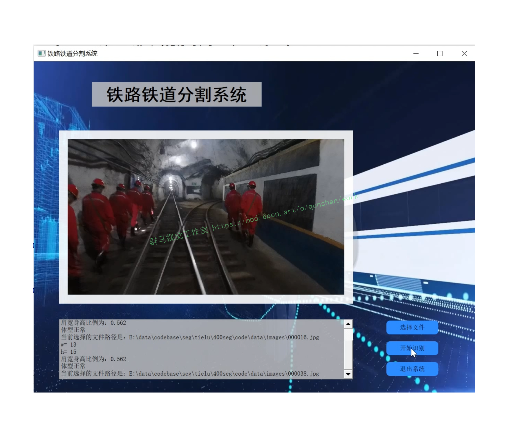
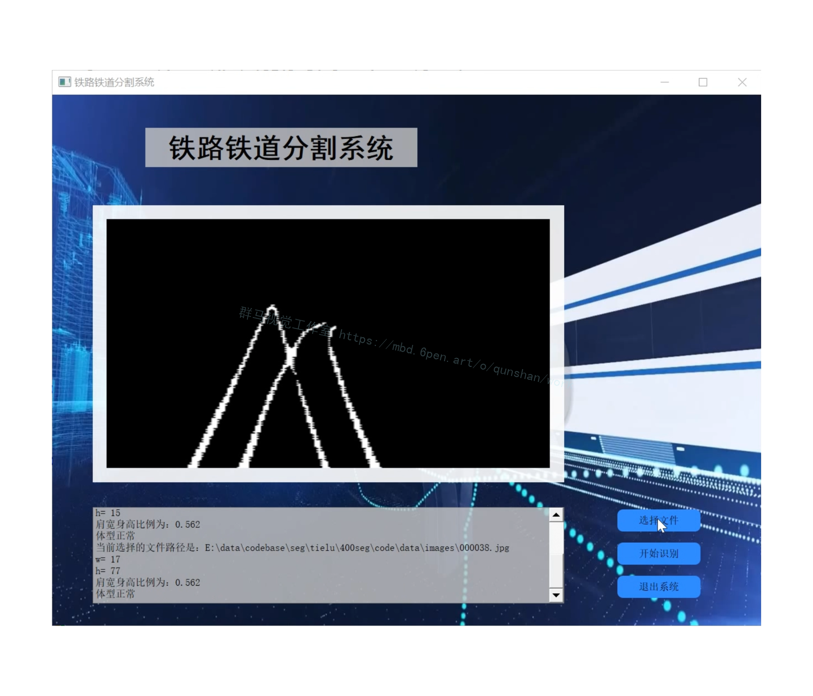
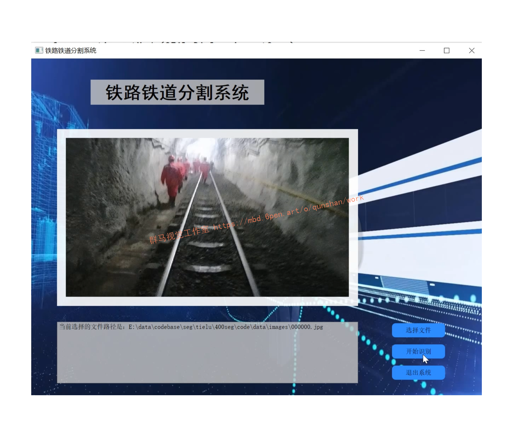
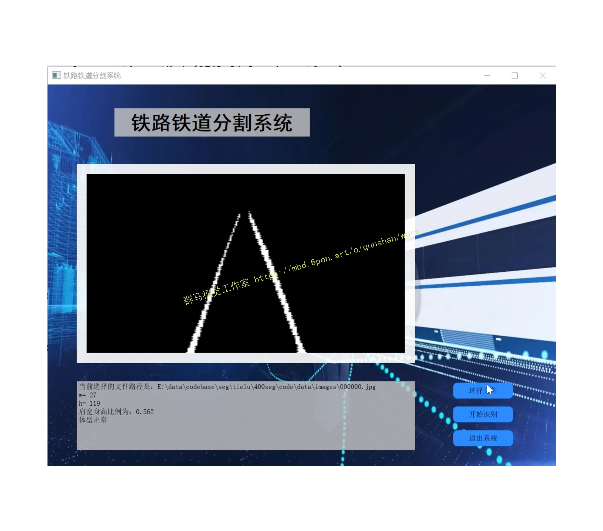
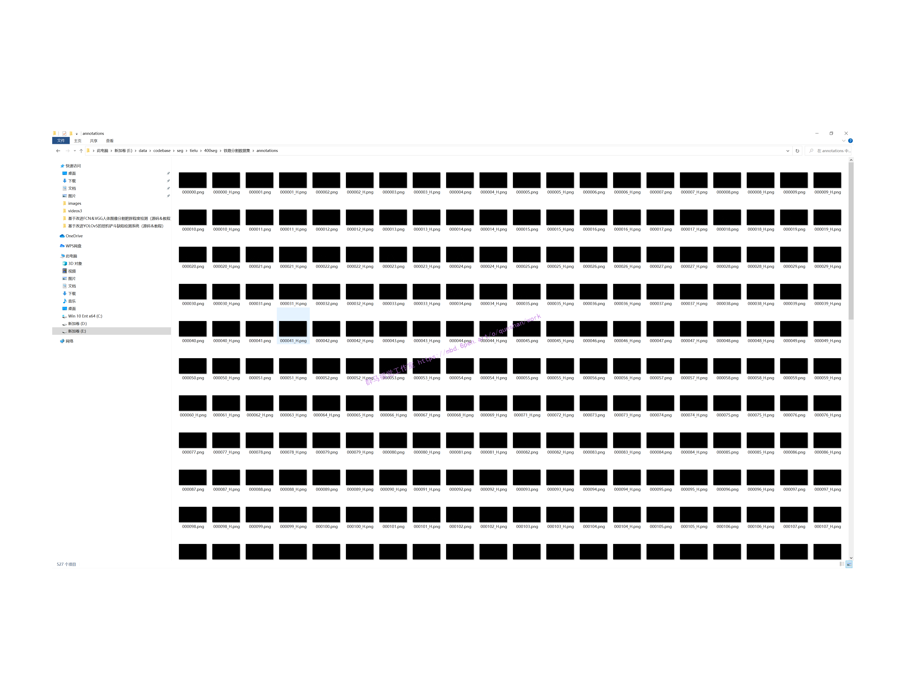
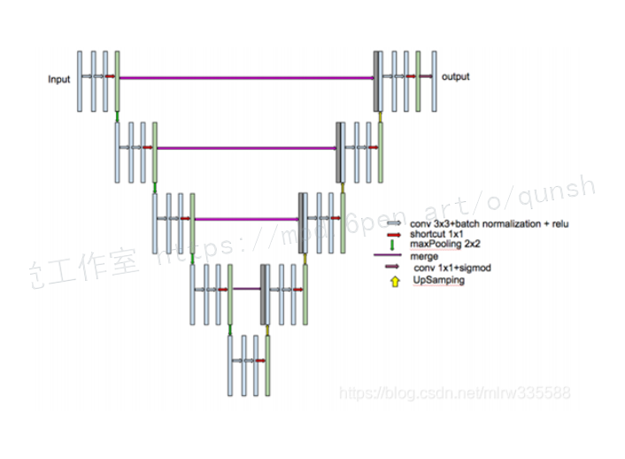
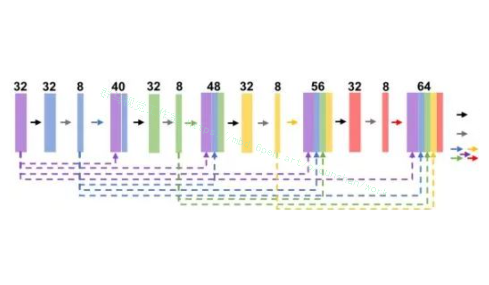
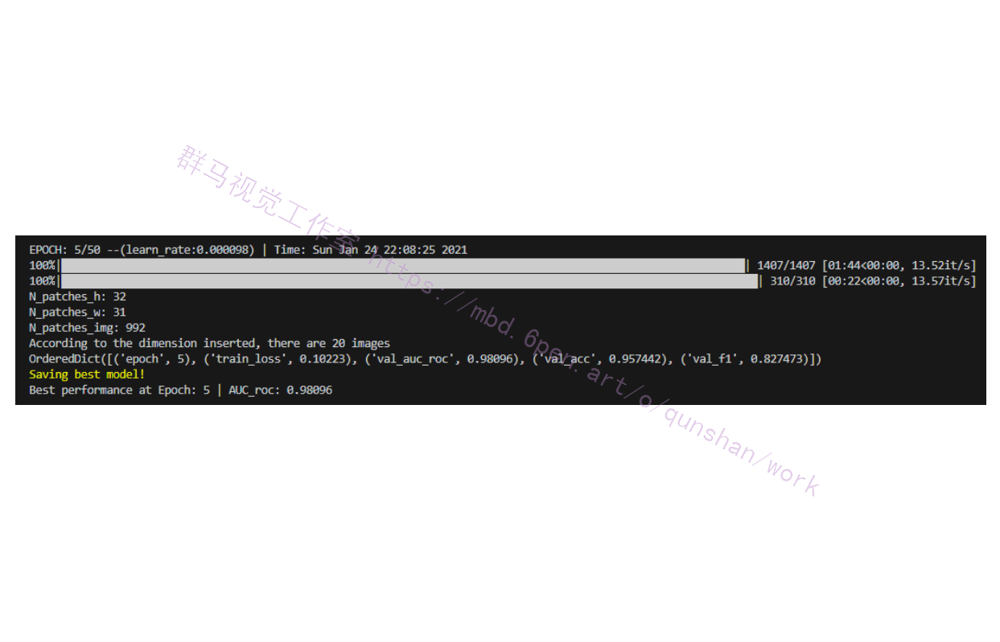
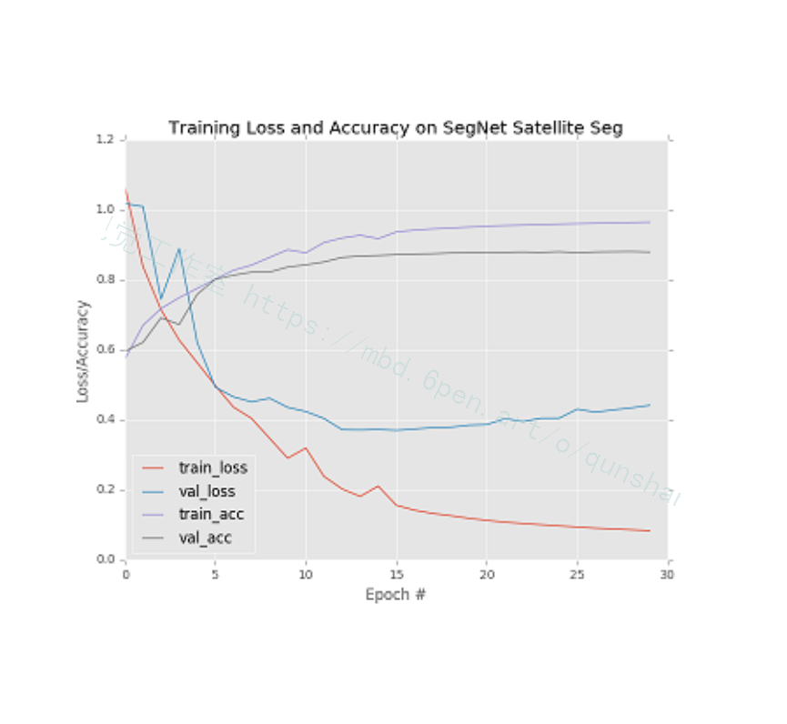
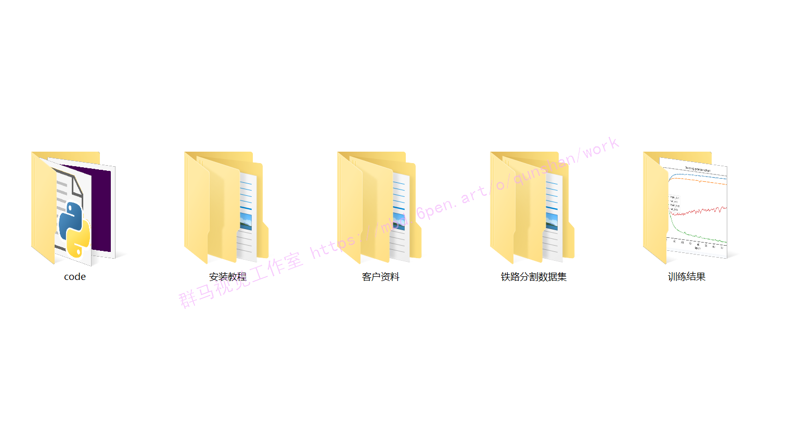

# 1.研究背景
在铁路无人驾驶领域中,城市轨道交通中的地铁列车运行环境相对的封闭[1，2]。使得较容易开展无人驾驶,从上世纪80年代开始无人驾驶系统应用于法国、日本、马来西亚、加拿大,新加坡等国家﹐国内城市轨道交通中北京、上海、重庆、深圳均有地铁线路应用了无人驾驶系统[3]。相比于汽车与轨道交通的自动驾驶,地上铁路的无人驾驶有其独特性,铁路的运行环境相对汽车具有封闭性,但是相对于轨道交通的运行环境又是开放的,铁路机车是依据列控系统的信号进行运行的,随着铁路机车自动化水平的提高,现有运行系统配合环境感知系统即可实现无人驾驶。


# 2.图片效果展示









# 3.视频效果演示
[基于改进U-Net的铁道轨道分割系统（源码＆教程）_哔哩哔哩_bilibili](https://www.bilibili.com/video/BV1i14y1a7e5/?spm_id_from=333.999.0.0&vd_source=bc9aec86d164b67a7004b996143742dc)


# 4.铁路分割数据集





# 5.改进U-Net网络
#### U-net与ResNet结合
[参考该博客改进后的U-NET](https://mbd.pub/o/bread/Y5ibl5hp)分为收缩网络以及扩张网络两部分。

收缩网络与U-NET中的收缩网络类似，有所不同的是，对于每一层输出的结果先进行规范化处理，随后通过激活函数进行激活。每一个下采样包含两个3x3的卷积层，一个1x1的“捷径”以及一个2x2的池化层。

扩张网络与 U-NET 中的扩张网络类似，每一次上采样包含两个 3x3的卷积层，一个 1x1 的“捷径”，在每一次上采样之前，需要合并收缩网络与之相对应的结果。与收缩网络相似，扩张网络中每一层输出结果都需要先进性规范化处理，随后通过激活函数进行激活。最后，加入 1x1 的卷积网络确定 该特征图所对应的结果。

改进后的 U-NET 网络结构如下图所示

Res-UNet和Dense-UNet分别受到残差连接和密集连接的启发，将UNet的每一个子模块分别替换为具有残差连接和密集连接的形式。将Res-UNet用于视网膜图像的分割，其结构如下图所示，其中灰色实线表示各个模块中添加的残差连接。

[该博客提出的改进后的网络](https://afdian.net/item?plan_id=591c6cf65b2311edafab52540025c377)除了MultiRes模块以外，还提出了一个残差路径(ResPath), 使编码器的特征在与解码器中的对应特征拼接之前，先进行了一些额外的卷积操作，如下图所示。作者认为编码器中的特征由于卷积层数较浅，是低层次的特征，而解码器中对应的特征由于卷积层更深，是较高层次的特征，二者在语义上有较大差距，推测不宜直接将二者进行拼接。因此，使用额外的ResPath使二者在拼接前具有一致的深度，在ResPath1， 2， 3， 4中分别使用4，3，2，1个卷积层。


#### 代码实现
```
from keras.layers import Input, Conv2D, MaxPooling2D, Conv2DTranspose, concatenate, BatchNormalization, Activation, add
from keras.models import Model, model_from_json
from keras.optimizers import Adam
from keras.layers.advanced_activations import ELU, LeakyReLU
from keras.utils.vis_utils import plot_model


def conv2d_bn(x, filters, num_row, num_col, padding='same', strides=(1, 1), activation='relu', name=None):
    '''
    2D Convolutional layers
   
    Arguments:
        x {keras layer} -- input layer
        filters {int} -- number of filters
        num_row {int} -- number of rows in filters
        num_col {int} -- number of columns in filters
   
    Keyword Arguments:
        padding {str} -- mode of padding (default: {'same'})
        strides {tuple} -- stride of convolution operation (default: {(1, 1)})
        activation {str} -- activation function (default: {'relu'})
        name {str} -- name of the layer (default: {None})
   
    Returns:
        [keras layer] -- [output layer]
    '''

    x = Conv2D(filters, (num_row, num_col), strides=strides, padding=padding, use_bias=False)(x)
    x = BatchNormalization(axis=3, scale=False)(x)

    if(activation == None):
        return x

    x = Activation(activation, name=name)(x)

    return x


def trans_conv2d_bn(x, filters, num_row, num_col, padding='same', strides=(2, 2), name=None):
    '''
    2D Transposed Convolutional layers
   
    Arguments:
        x {keras layer} -- input layer
        filters {int} -- number of filters
        num_row {int} -- number of rows in filters
        num_col {int} -- number of columns in filters
   
    Keyword Arguments:
        padding {str} -- mode of padding (default: {'same'})
        strides {tuple} -- stride of convolution operation (default: {(2, 2)})
        name {str} -- name of the layer (default: {None})
   
    Returns:
        [keras layer] -- [output layer]
    '''

    x = Conv2DTranspose(filters, (num_row, num_col), strides=strides, padding=padding)(x)
    x = BatchNormalization(axis=3, scale=False)(x)
   
    return x


def MultiResBlock(U, inp, alpha = 1.67):
    '''
    MultiRes Block
   
    Arguments:
        U {int} -- Number of filters in a corrsponding UNet stage
        inp {keras layer} -- input layer
   
    Returns:
        [keras layer] -- [output layer]
    '''

    W = alpha * U

    shortcut = inp

    shortcut = conv2d_bn(shortcut, int(W*0.167) + int(W*0.333) +
                         int(W*0.5), 1, 1, activation=None, padding='same')

    conv3x3 = conv2d_bn(inp, int(W*0.167), 3, 3,
                        activation='relu', padding='same')

    conv5x5 = conv2d_bn(conv3x3, int(W*0.333), 3, 3,
                        activation='relu', padding='same')

    conv7x7 = conv2d_bn(conv5x5, int(W*0.5), 3, 3,
                        activation='relu', padding='same')

    out = concatenate([conv3x3, conv5x5, conv7x7], axis=3)
    out = BatchNormalization(axis=3)(out)

    out = add([shortcut, out])
    out = Activation('relu')(out)
    out = BatchNormalization(axis=3)(out)

    return out


def ResPath(filters, length, inp):
    '''
    ResPath
   
    Arguments:
        filters {int} -- [description]
        length {int} -- length of ResPath
        inp {keras layer} -- input layer
   
    Returns:
        [keras layer] -- [output layer]
    '''


    shortcut = inp
    shortcut = conv2d_bn(shortcut, filters, 1, 1,
                         activation=None, padding='same')

    out = conv2d_bn(inp, filters, 3, 3, activation='relu', padding='same')

    out = add([shortcut, out])
    out = Activation('relu')(out)
    out = BatchNormalization(axis=3)(out)

    for i in range(length-1):

        shortcut = out
        shortcut = conv2d_bn(shortcut, filters, 1, 1,
                             activation=None, padding='same')

        out = conv2d_bn(out, filters, 3, 3, activation='relu', padding='same')

        out = add([shortcut, out])
        out = Activation('relu')(out)
        out = BatchNormalization(axis=3)(out)

    return out


def MultiResUnet(height, width, n_channels):
    '''
    MultiResUNet
   
    Arguments:
        height {int} -- height of image
        width {int} -- width of image
        n_channels {int} -- number of channels in image
   
    Returns:
        [keras model] -- MultiResUNet model
    '''


    inputs = Input((height, width, n_channels))

    mresblock1 = MultiResBlock(32, inputs)
    pool1 = MaxPooling2D(pool_size=(2, 2))(mresblock1)
    mresblock1 = ResPath(32, 4, mresblock1)

    mresblock2 = MultiResBlock(32*2, pool1)
    pool2 = MaxPooling2D(pool_size=(2, 2))(mresblock2)
    mresblock2 = ResPath(32*2, 3, mresblock2)

    mresblock3 = MultiResBlock(32*4, pool2)
    pool3 = MaxPooling2D(pool_size=(2, 2))(mresblock3)
    mresblock3 = ResPath(32*4, 2, mresblock3)

    mresblock4 = MultiResBlock(32*8, pool3)
    pool4 = MaxPooling2D(pool_size=(2, 2))(mresblock4)
    mresblock4 = ResPath(32*8, 1, mresblock4)

    mresblock5 = MultiResBlock(32*16, pool4)

    up6 = concatenate([Conv2DTranspose(
        32*8, (2, 2), strides=(2, 2), padding='same')(mresblock5), mresblock4], axis=3)
    mresblock6 = MultiResBlock(32*8, up6)

    up7 = concatenate([Conv2DTranspose(
        32*4, (2, 2), strides=(2, 2), padding='same')(mresblock6), mresblock3], axis=3)
    mresblock7 = MultiResBlock(32*4, up7)

    up8 = concatenate([Conv2DTranspose(
        32*2, (2, 2), strides=(2, 2), padding='same')(mresblock7), mresblock2], axis=3)
    mresblock8 = MultiResBlock(32*2, up8)

    up9 = concatenate([Conv2DTranspose(32, (2, 2), strides=(
        2, 2), padding='same')(mresblock8), mresblock1], axis=3)
    mresblock9 = MultiResBlock(32, up9)

    conv10 = conv2d_bn(mresblock9, 1, 1, 1, activation='sigmoid')
   
    model = Model(inputs=[inputs], outputs=[conv10])

    return model
```


# 6.环境配置
tensorflow-gpu==2.3.0
numpy==1.21.5
matplotlib==3.5.1

# 7. 创建数据集路径索引文件
项目根目录下的"./prepare_dataset"目录下有三个文件：drive.py，stare.py和chasedb1.py。分别将三个文件中的“data_root_path”参数赋值为上述3.2准备好的数据集的绝对路径（例如: data_root_path="/home/lee/datasets"）。然后分别运行：

python ./prepare_dataset/drive.py  
python ./prepare_dataset/stare.py
python ./prepare_dataset/chasedb1.py         
即可在"./prepare_dataset/data_path_list"目录下对应的数据集文件夹中生成"train.txt"和"test.txt"文件，分别存储了用于训练和测试的数据路径（每行依次存储原图，标签和FOV路径（用空格隔开））。

# 8.训练模型
在根目录下的"config.py"文件中修改超参数以及其他配置信息。特别要注意 “train_data_path_list"和"test_data_path_list"这两个参数，分别指向3.3中创建的某一个数据集的"train.txt"和"text.txt"。 在"train.py"中构造创建好的模型（所有模型都在"./models"内手撕），例如指定UNet模型：

net = models.UNetFamily.U_Net(1,2).to(device)  # line 103 in train.py
修改完成后，在项目根目录执行:

CUDA_VISIBLE_DEVICES=1 python train.py --save UNet_vessel_seg --batch_size 64
上述命令将在1号GPU上执行训练程序，训练结果保存在“ ./experiments/UNet_vessel_seg”文件夹中，batchsize取64，其余参数取config.py中的默认参数。

可以在config中配置培训信息，也可以用命令行修改配置参数。训练结果将保存到“ ./experiments”文件夹中的相应目录（保存目录的名称用参数"--save"指定）。

此外，需要注意一点，config文件中有个“val_on_test”参数。当其为真时表示会在训练的每个epoch结束后在测试集上进行性能评估，并选取"AUC of ROC"最高的模型保存为“best_model.pth”；当其为假时，会用验证集性能评估结果(AUC of ROC)保存模型。当然保存最佳模型依据的指标可以自行修改，默认为AUC of ROC。



# 9.测试评估

在“test.py”文件中构造对应的模型（同上），例如指定UNet模型：

net = models.UNetFamily.U_Net(1,2).to(device)
测试过程也需要"./config.py"中的相关参数，也可以在运行时通过命令行参数修改。

然后运行：

CUDA_VISIBLE_DEVICES=1 python test.py --save UNet_vessel_seg  
上述命令将训练好的“./experiments /UNet_vessel_seg/best_model.pth”参数加载到相应的模型，并在测试集上进行性能测试，其测试性能指标结果保存在同一文件夹中的"performance.txt"中，同时会绘制相应的可视化结果。



# 10.系统整合：
此处获取下图[源码＆环境部署视频教程＆轨道分割数据集](https://s.xiaocichang.com/s/2e5f10)



# 11.参考文献
[1]卢宏涛,张秦川.深度卷积神经网络在计算机视觉中的应用研究综述[D].2016
[2]王洪升,曾连荪,田蔚风.人工智能在车辆自动驾驶中的应用[D].2004
[3]路向阳,李雷,雷成健,等.城市轨道交通全自动驾驶技术发展综述[D].2018
[4]He, Kaiming,Gkioxari, Georgia,Dollar, Piotr,等.Mask R-CNN[J].IEEE Transactions on Pattern Analysis and Machine Intelligence.2020,42(2).386-397.DOI:10.1109/TPAMI.2018.2844175.

---
#### 如果您需要更详细的【源码和环境部署教程】，除了通过【系统整合】小节的链接获取之外，还可以通过邮箱以下途径获取:
#### 1.请先在GitHub上为该项目点赞（Star），编辑一封邮件，附上点赞的截图、项目的中文描述概述（About）以及您的用途需求，发送到我们的邮箱
#### sharecode@yeah.net
#### 2.我们收到邮件后会定期根据邮件的接收顺序将【完整源码和环境部署教程】发送到您的邮箱。
#### 【免责声明】本文来源于用户投稿，如果侵犯任何第三方的合法权益，可通过邮箱联系删除。